# YARDS ー Yu-Gi-Oh! AR Dueling System
操作マニュアル

* 2018年10月17日 初版

# 概要
遊戯王を遊んでいる人なら、誰しも1度は憧れる**ソリッドビジョン**。それを現実のものにしたいと思い、まずはモンスターの実体化以外の部分から取り掛かってみました。
本稿ではこのシステムの操作方法について主にご紹介します。原作およびその派生作品では、デュエルディスクがすべて自動で処理してくれていますが、そこまで高度なAIを作れる技術はまだ僕にはないので、スマートフォンによる操作で代用しています。
演出のために決闘しながらタブレット端末を操作するため、普段決闘するよりは少し手間にはなってしまいます。しかし、たくさんあるからといって、全ての機能を使う必要はありません。皆さんが使っていく中で、必要な機能だけ切り出して使ってもらえたらと思っています。
このシステムが、遊戯王の新しい遊び方として広まっていけばとても嬉しく思います。ぜひ触ってみてください！

# 画面構成
基本的には、ログイン画面とホーム画面の2つで構成されており、ホーム画面には4つのタブがあります。
また、融合・儀式・シンクロ・エクシーズ・ペンデュラム・リンクといった特別な召喚方法 (以下、EX召喚) については、ホーム画面からそれぞれ異なる画面に遷移して操作を行います。

## ログイン画面
このシステムを使用するために、ログインするプレイヤーを選択する画面です。

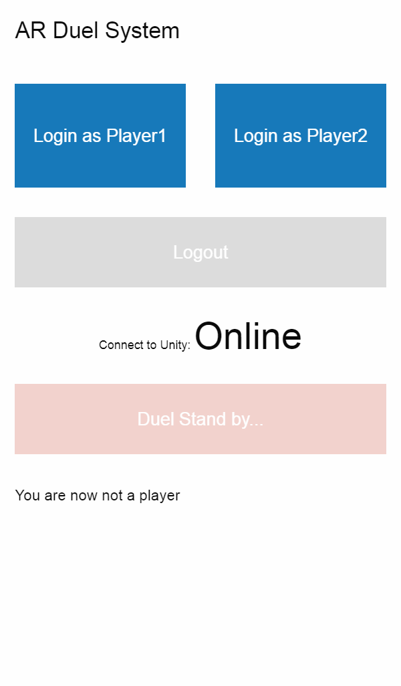

* `Login as Player1 ボタン` : このボタンを押すと、Player1としてシステムにログインします。
* `Login as Player2 ボタン` : このボタンを押すと、Player2としてシステムにログインします。
* `Logout ボタン` : Player1もしくはPlayer2のどちらかにログインしている場合、このボタンを押すとログアウトします。
* `ステータス確認領域` : プレイヤーにログインしているか、どちらのプレイヤーにログインしているか、フィールドがシステムに接続しているかを表示している。
* `Duel stand by ボタン` : どちらかのプレイヤーにログインしている状態でこのボタンを押すと、ログインしたプレイヤーのホーム画面に遷移する。

## ホーム画面
このシステムを操作するための基本画面です。召喚や効果発動からアイテムの使用まで、ありとあらゆる機能がここに詰まっています。

### LP etc タブ
LP・アイテム・ペンデュラムスケールを使用できる画面です。

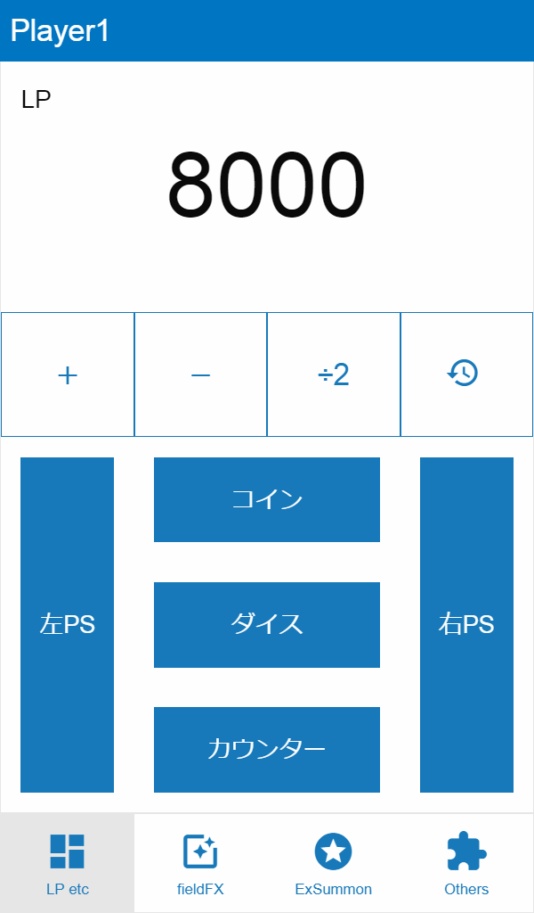

* `LP 表示部` : 自分のLPを表示しています。
* `LP 計算部` : 自分のLPを計算できます。
* `LP 履歴ボタン` : お互いのプレイヤーが過去にどのようなLP計算を行ったかを表示します。また、過去のLPの状態に戻すことができます。
* `アイテムボタン` : コイン・ダイス・カウンターを使用できます。
* `ペンデュラムスケールボタン` : 自分のPゾーンに置いたカードのスケールを設定できます。

### Field FX タブ
フィールド上で適用されるエフェクトを使用できる画面です。

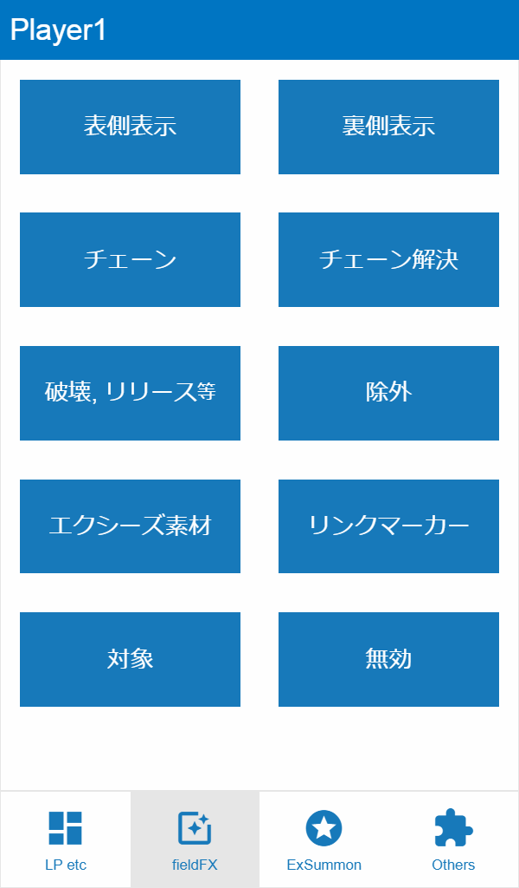

* `表側表示ボタン` : カードを表側表示で出す場合のエフェクトを使用できます。
* `裏側表示ボタン` : カードを裏側表示で出す場合のエフェクトを使用できます。
* `チェーンボタン` : カードの効果が発動した場合のエフェクトを使用できます。
* `チェーン解決ボタン` : チェーンボタンで適用したエフェクトを解除する場合に使用します。
* `破壊・リリース等ボタン` : 除外以外の方法でカードがフィールドから離れる際のエフェクトを使用できます。
* `除外ボタン` : カードが除外される際のエフェクトを使用できます。
* `エクシーズ素材ボタン` : エクシーズ素材を取り除いたり、増やしたりする際のエフェクトを使用できます。
* `リンクマーカーボタン` : リンクモンスターと同じリンクマーカーを持ったリングを表示する際のエフェクトを使用できます。また、リンクマーカーの変更も行えます。
* `対象ボタン` : カードを対象に取る際や、カードを強調する際のエフェクトを使用できます。
* `無効ボタン` : カードの効果が無効になった際や、フィールドのゾーンが使用できなくなった際のエフェクトを使用できます。

### EX summon タブ
EX召喚を行う際のエフェクトを使用する画面に遷移します。

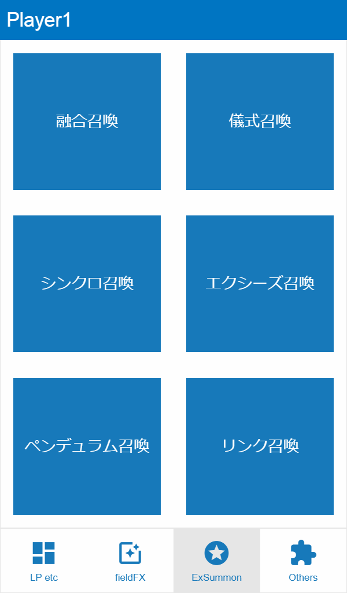

* `融合ボタン` : 融合召喚を行う際のエフェクトを使用できます。
* `儀式ボタン` : 儀式召喚を行う際のエフェクトを使用できます。
* `シンクロボタン` : シンクロ召喚を行う際のエフェクトを使用できます。
* `エクシーズボタン` : エクシーズ召喚を行う際のエフェクトを使用できます。
* `ペンデュラムボタン` : ペンデュラム召喚を行う際のエフェクトを使用できます。
* `リンクボタン` : リンク召喚を行う際のエフェクトを使用できます。

### Others タブ
上記タブ以外の操作を行う画面です。

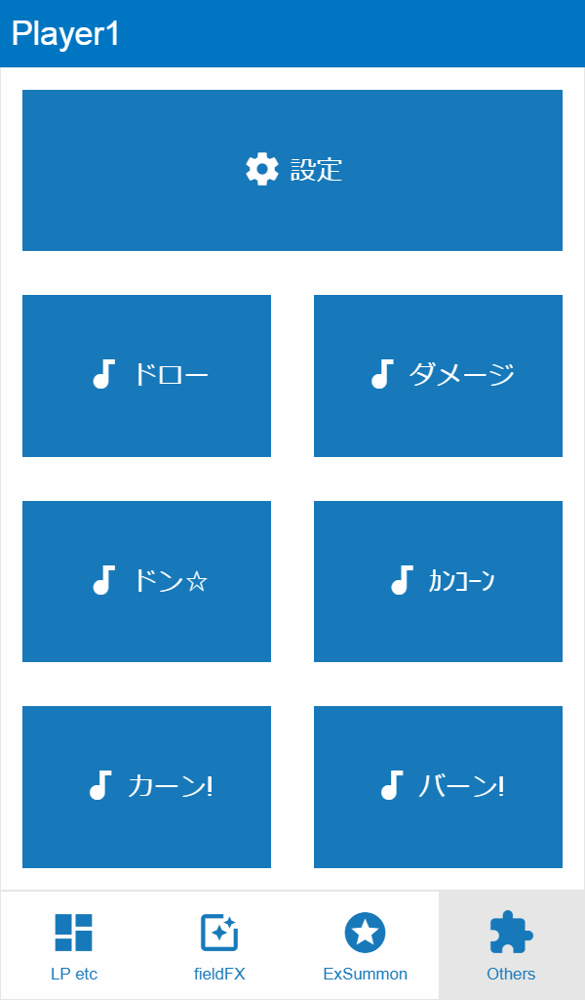

* `設定ボタン` : 各種設定などを行う画面です。
* `効果音ボタン` : 効果音を鳴らすことができます。

## フィールド選択画面
エフェクトを適用する際に使用する画面は、基本的に下記のようになっています。タイトルや下部にあるボタンは、エフェクトによって文言や動作が変わります。

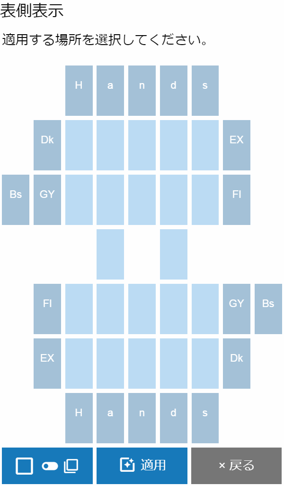

* `ゾーンボタン` : 各種エフェクトを適用するゾーンを指定するために使用します。
* `切替ボタン` : エフェクトの種類や状態・適用のさせ方を切り替えるために使用します。
* `適用ボタン` : 主に、各種エフェクトを適用するために使用します。
* `戻るボタン` : エフェクトを適用せずに元のホーム画面に戻るために使用します。

## EX召喚画面
EX召喚を行う際の画面です。基本的にはフィールド選択画面と同じような構成なので図は省略しますが、EX召喚の際に必要となる情報をここで入力します。

# 操作方法
## ログイン・ログアウト
このシステムを使用する際、最初はログイン画面が表示されます。どちらのプレイヤーでログインするか、この画面で決定することになります。
ログイン画面には複数の人がアクセスできます。誰かがプレイヤーとしてログインすると、リアルタイムにステータスが更新されます。

### ログイン
1. ログイン画面に遷移します。

	

2. ログインするプレイヤーのボタンを選択してください。押し間違えた場合は、一旦「Logout」ボタンを押すか、もう片方のプレイヤーのボタンを押してください。

	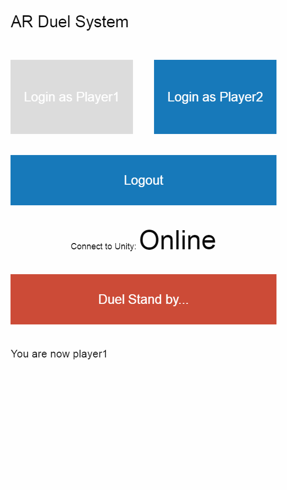

3. 自分がログインするプレイヤーに間違いがなければ、「Duel stand by」ボタンを押してください。すると、ホーム画面に遷移します。

### ログアウト
1. ホーム画面のOthersタブに遷移します。

	

2. 「設定」ボタンを選択してください。
3. 「ログアウト」ボタンを押すと、ログイン画面に遷移し、自動的にログアウトされます。

	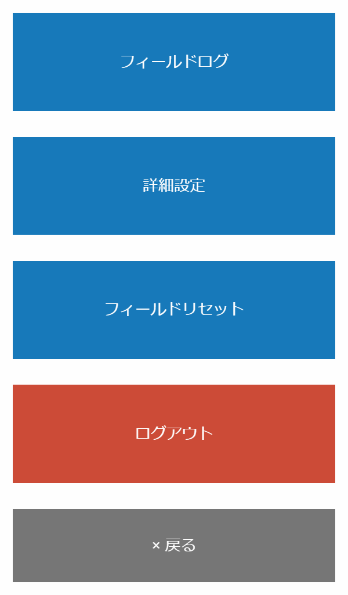

## LP計算
自分のLPを計算する際に使用します。

### +/- ボタン
1. ホーム画面の LP etc タブに遷移します。

	

2. LP計算部の「+」ボタンもしくは「-」ボタンを選択します。
3. 電卓の画面になるので、数値をボタンで入力してください。  

	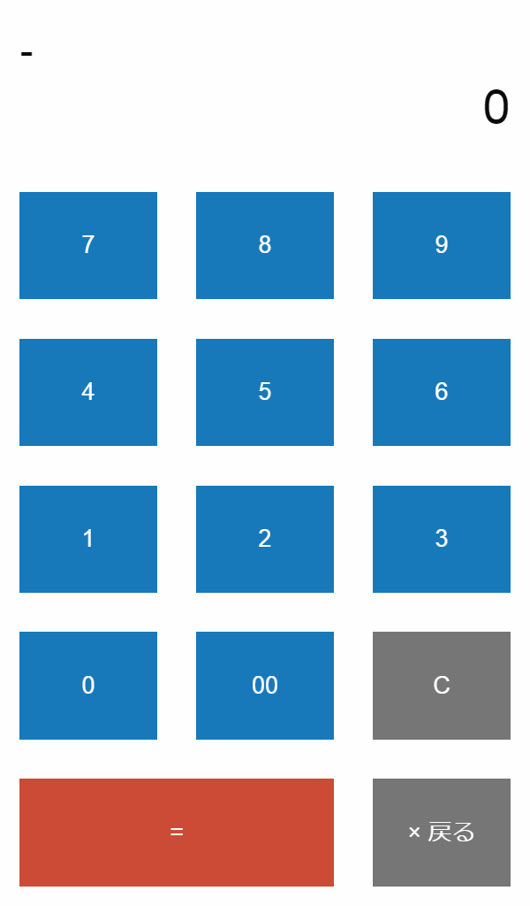

4. 「=」ボタンを押すと、その数値分が加減されます。
5. その後、自動的にホーム画面に遷移します。

### ÷2 ボタン
1. ホーム画面の LP etc タブに遷移します。

	

2. LP計算部の「÷2」ボタンを選択します。
3. 結果、自分のLPが半分になります。なお、割り切れなかった場合は切り上げます。

### 履歴ボタン
お互いのプレイヤーのLPを過去の状態に戻します。もしLPを計算し間違えた場合はこちらから修正することができます。

1. ホーム画面の LP etc タブに遷移します。

	

2. LP計算部の「履歴」ボタンを選択します。
3. LPの履歴が表示されるので、戻りたいLPを探します。

	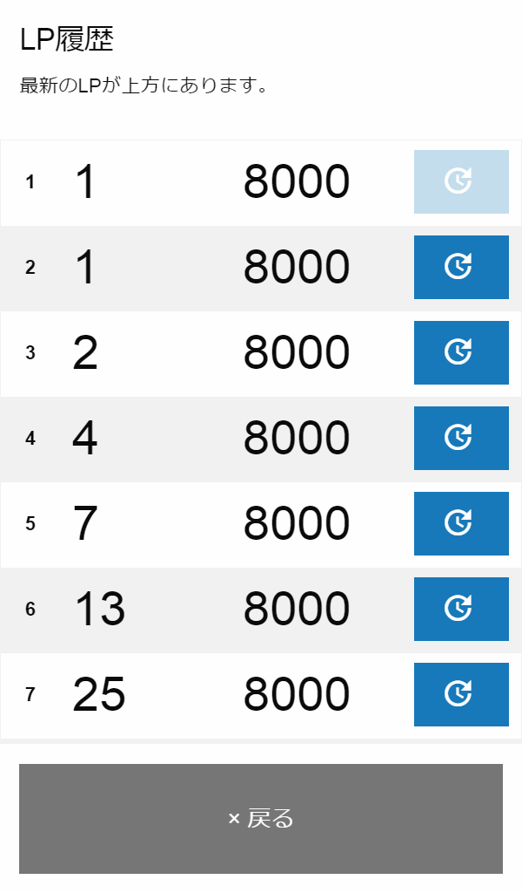

4. 「更新」ボタンを押すと、お互いのプレイヤーのLPが選択した時の状態になります。  その後、自動的にホーム画面に遷移します。
5. 過去のLPに戻った状態でLPを計算すると、そのLPより新しい履歴は削除されます。

## フィールドエフェクト
フィールド上の各ゾーンに、様々なエフェクトを効果音とともに出現させます。

### フィールドにカードを出す
フィールドにカードを出す際のエフェクトは、「表側表示」もしくは「裏側表示」のボタンを使用します。「表側表示」であれば召喚およびカードの出現のエフェクト、「裏側表示」であればセットのエフェクトになります。

1. ホーム画面の FieldFX タブに遷移します。

	

2. 「表側表示」ボタンもしくは「裏側表示」のボタンを選択します。
3. フィールド選択画面が出現するので、エフェクトを適用したいゾーンを指定してください。

	

	> **単数選択/複数選択モード**  
	> 下方左側のボタンを押すと、指定するゾーンを1つだけ選ぶのか複数選ぶのかを切り替えることができます。現在のモードは、ボタン内のトグルの向きで確認できます。  
	> 複数のゾーンを指定した場合は、それらすべてのゾーンにエフェクトが適用されます。
	> 
	> 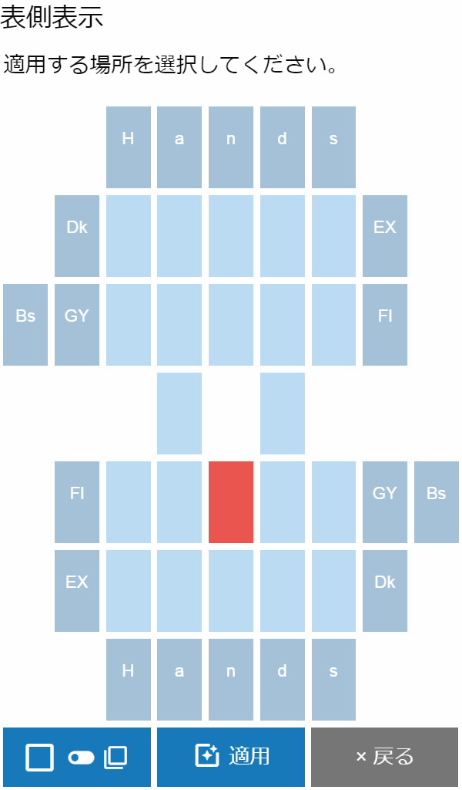 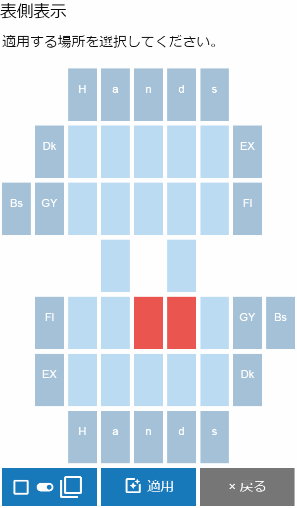

4. 下方中央の「適用」ボタンを押すと、エフェクトが出現し、ホーム画面に遷移します。  
一方、「適用」ボタンを押さずに下方右側の「戻る」ボタンを押すと、エフェクトが出現せずにホーム画面に遷移します。

### カードがフィールドから離れる
カードがフィールドから離れる際のエフェクトは、「破壊・リリース等」もしくは「除外」のボタンを使用します。除外する場合以外は、基本的に「破壊・リリース等」のボタンを使用してください。
これらのエフェクトが適用されたゾーンは、すべての情報がリセットされます。

1. ホーム画面の FieldFX タブに遷移します。

	

2. 「破壊・リリース等」もしくは「除外」のボタンを選択します。
3. フィールド選択画面が出現するので、エフェクトを適用したいゾーンを指定してください。

	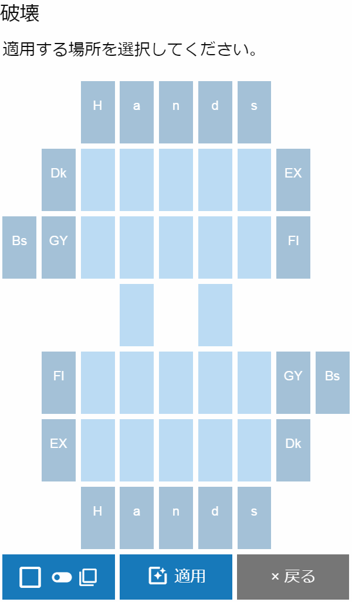

4. 下方中央の「適用」ボタンを押すと、エフェクトが出現し、ホーム画面に遷移します。  
一方、「適用」ボタンを押さずに下方右側の「戻る」ボタンを押すと、エフェクトが出現せずにホーム画面に遷移します。

### カードおよび効果の発動
カードおよび効果の発動をする際のエフェクトは、「チェーン」のボタンを使用します。このボタンを使用すると、チェーンのエフェクトが出現するので、効果解決時の確認がしやすくなります。
なお、このエフェクトでは複数選択モードは使用できません。単数選択モードのみです。

1. ホーム画面の FieldFX タブに遷移します。

	

2. 「チェーン」ボタンを選択します。
3. フィールド選択画面が出現するので、エフェクトを適用したいゾーンを指定します。

	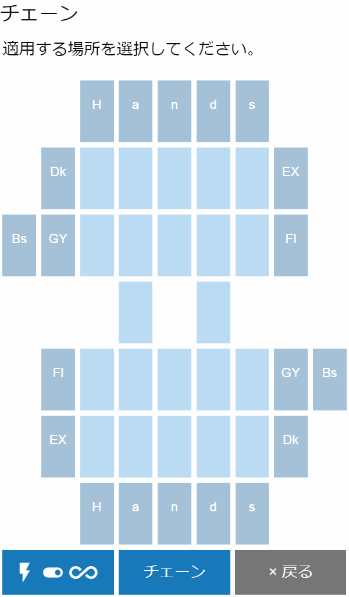

	> **単発/永続モード**  
	> 下方左側のボタンを押すと、使い切りのカード (通常魔法・罠など) と永続的に残るカード (永続魔法・罠など) との設定を切り替えることができます。前者を `単発モード` 、後者を `永続モード` と呼びます。  
	> 「チェーン」ボタンを押した時は、永続モードが選択されています。現在のモードは、ボタン内のトグルの向きで確認できます。  
	> 「適用」ボタンを押す前にこの選択を行なっておくと、この後説明するチェーン解決時に役に立ちます。  
	>
	>  

4. 下方中央の「適用」ボタンを押すと、エフェクトが出現し、ホーム画面に遷移します。  
   一方、「適用」ボタンを押さずに下方右側の「戻る」ボタンを押すと、エフェクトが出現せずにホーム画面に遷移します。

### チェーン解決
カードの効果を解決する際のエフェクトは、「チェーン解決」のボタンを使用します。他のボタンと同じく、ホーム画面の FieldFX タブに存在します。大きく分けて2つの使い方をします。

* チェーンブロックが存在する場合は、チェーンの数の大きいものから順にエフェクトが適用 (効果解決) されます。
* チェーンブロックがすべて解決した場合に1度だけ、「カードおよび効果の発動」を行う際に `単発モード` を選択したゾーンに、破壊のエフェクトが適用されます。

### 対象に取る
対象に取る際や、めくったカードの中から1枚を相手に選んでもらう際などのエフェクトは、「対象」のボタンを使用します。このボタンを使用するとゾーンが強調されるので、必要に応じて使用してください。
なお、このエフェクトでは複数選択モードがデフォルトになっています。

1. ホーム画面の FieldFX タブに遷移します。

	  

2. 「対象」ボタンを選択します。

	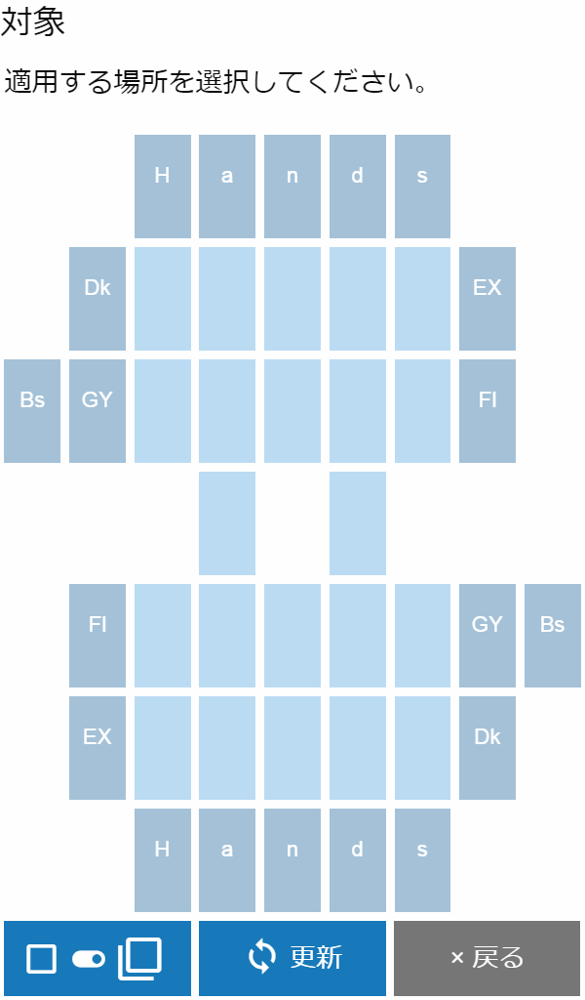

3. フィールド選択画面が出現するので、エフェクトを適用したいゾーンを指定します。
4. 下方中央の「更新」ボタンを押すと、指定したゾーンにエフェクトが適用されます。この時、ホーム画面には自動で遷移しません。
5. 下方右側の「戻る」ボタンを押すと、 __現在適用しているエフェクトが残ったまま__ 元の画面に戻ります。
6. エフェクトを解除する場合は、 __ゾーンの指定を解除してから「更新」ボタンを押し、__ エフェクトが解除されたのを確認してから「戻る」ボタンを押してください。

### 無効にする・ゾーンを使用できなくする
カードの効果を無効にする際や、指定したゾーンを使用できなくする際などのエフェクトは、「無効」のボタンを使用します。このボタンを使用するとゾーンに禁止マークが出現するので、必要に応じて使用してください。
なお、このエフェクトでは複数選択モードがデフォルトになっています。

1. ホーム画面の FieldFX タブに遷移します。

	  

2. 「無効」ボタンを選択します。
3. フィールド選択画面が出現するので、エフェクトを適用したいゾーンを指定します。

	  

4. 下方中央の「更新」ボタンを押すと、指定したゾーンにエフェクトが適用されます。この時、ホーム画面には自動で遷移しません。
5. 下方右側の「戻る」ボタンを押すと、 __現在適用しているエフェクトが残ったまま__ 元の画面に戻ります。
6. エフェクトを解除する場合は、 __ゾーンの指定を解除してから「更新」ボタンを押し、__ エフェクトが解除されたのを確認してから「戻る」ボタンを押してください。

## 特別な召喚法
### 融合
融合召喚を行う際に使用します。

1. ホーム画面の EX summon タブに遷移します。

	

2. 「融合」ボタンを選択します。すると、フィールドには融合の渦が浮かび上がり、タブレット端末はEX召喚画面に遷移します。

	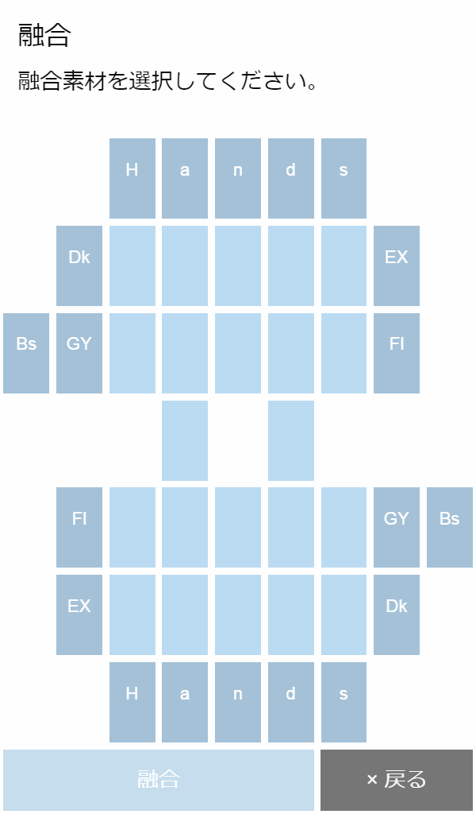  

3. 融合素材にするモンスターが存在するゾーンを指定してください。
4. 下部の「融合」ボタンを選択すると、融合素材に指定したゾーンから光が出現し、その光が融合の渦に飲み込まれます。その後、再びフィールド選択画面が出現します。

	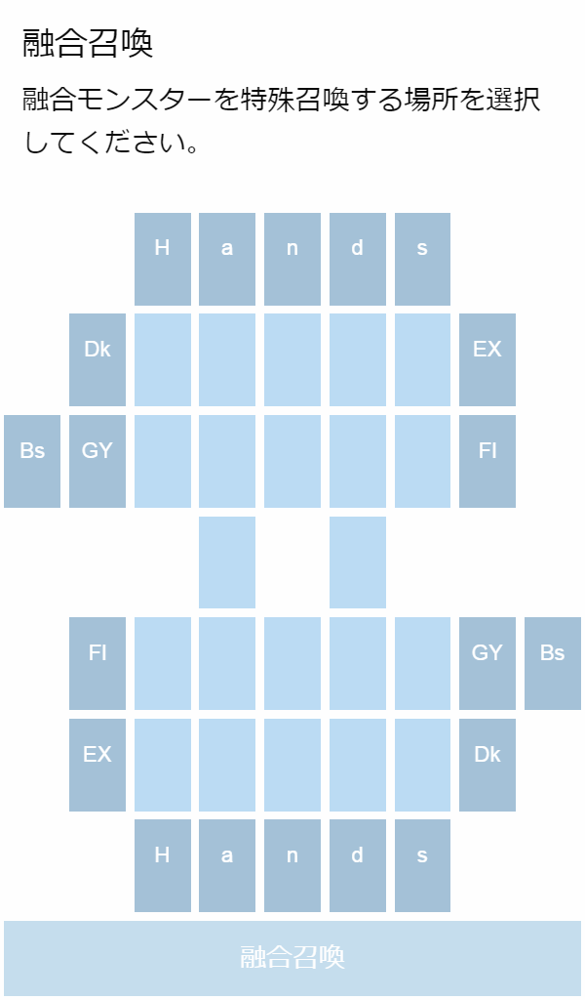

5. 融合モンスターの召喚場所を指定します。
6. 「融合召喚」ボタンを押すと、指定したゾーンにEX召喚のエフェクトが適用されます。その後、ホーム画面に遷移します。
7. 一方、4において「融合」ボタンを押さずに「戻る」ボタンを押すと、融合の渦が消え、ホーム画面に遷移します。

### 儀式
儀式召喚を行う際に使用します。

1. ホーム画面の EX summon タブに遷移します。

	

2. 「儀式」ボタンを選択します。すると、フィールドには魔方陣と炎が出現し、タブレット端末はEX召喚画面に遷移します。

	

3. 儀式素材にするモンスターが存在するゾーンを指定してください。
	1. ゾーンを指定すると、素材レベル設定画面が出現します。

		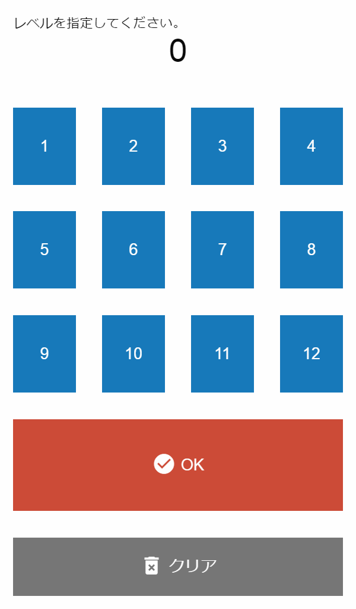

	2. ご自身の方針に合わせて、レベルを設定します。
		> **素材レベルの設定方針**
		> この後、魔方陣の周りにはここで設定した素材レベルの合計分の炎が出現します。この数はプレイヤーや撮影メンバーの方針に合わせて、下記のいずれかの方針で設定してください。  
		> ● 儀式召喚するモンスターのレベル分の炎が出現するように、素材レベルの合計を調整しながら儀式素材モンスターの素材レベルを設定する。  
		> ● 儀式素材とするモンスターのレベルの合計分の炎が出現するように、儀式素材モンスターのレベル分の素材レベルを設定する。  

	3. 「OK」ボタンを押すと、そのゾーンに素材レベルが設定されます。  
	   一方、「OK」ボタンを押さずに「クリア」ボタンを押すと、 __設定した素材レベルがクリア__ されます。
	4. EX召喚画面に遷移します。

4. 下部の「儀式」ボタンを選択すると、儀式素材に指定したゾーンから、設定した素材レベルの数だけ炎が出現します。その炎が魔方陣の周りに移動し、中央の炎が舞い上がります。その後、再びフィールド選択画面が出現します。

	

5. 儀式モンスターの召喚場所を指定します。
6. 「儀式召喚」ボタンを押すと、指定したゾーンにEX召喚のエフェクトが適用されます。その後、ホーム画面に遷移します。
7. 一方、4において「儀式」ボタンを押さずに「戻る」ボタンを押すと、魔方陣と炎が消え、ホーム画面に遷移します。

### シンクロ
シンクロ召喚を行う際に使用します。

1. ホーム画面の EX summon タブに遷移します。

	

2. 「シンクロ」ボタンを選択します。すると、フィールドには緑色の光の筋が出現し、タブレット端末はEX召喚画面に遷移します。

	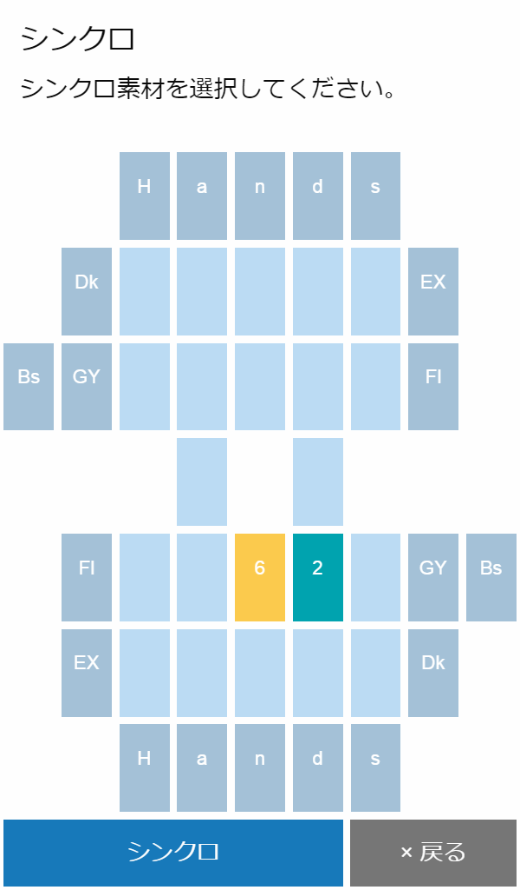

3. シンクロ素材にするモンスターが存在するゾーンを指定してください。
	1. ゾーンを指定すると、素材レベル設定画面が出現します。

		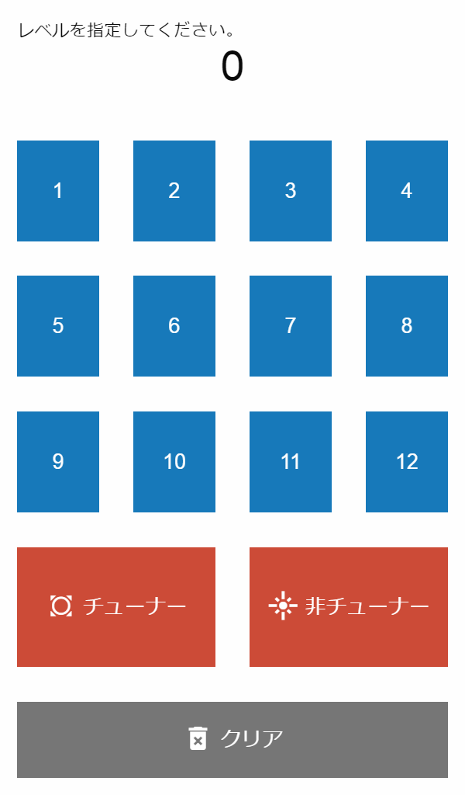

	2. シンクロ素材にするモンスターのレベルを設定します。
	3. 「チューナー」ボタンを押すと、指定したゾーンが緑色になり、素材レベルが設定されます。「非チューナー」ボタンを押すと、指定したゾーンが黄色になり、素材レベルが設定されます。一方、いずれのボタンも押さずに「クリア」ボタンを押すと、 __設定した素材レベルがクリア__ されます。
	4. EX召喚画面に遷移します。
4. 下部の「シンクロ」ボタンを選択すると、シンクロ素材に指定したゾーンから、設定した素材レベルの数だけ光が出現します。チューナーの光は奥に吸い込まれシンクロリングに変化し、非チューナーの光は1列に整列します。整列が終わると、一筋の光がフィールドに差し込みます。その後、再びフィールド選択画面が出現します。

	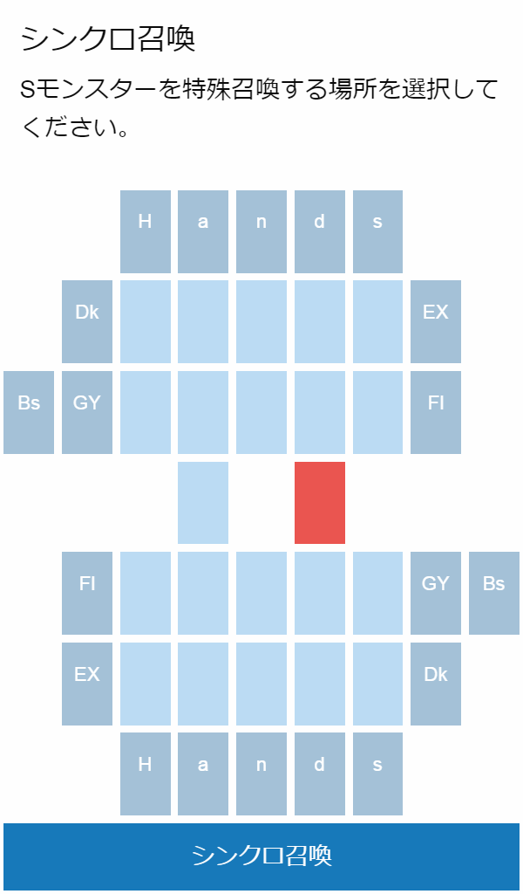

5. シンクロモンスターの召喚場所を指定します。
6. 「シンクロ召喚」ボタンを押すと、指定したゾーンにEX召喚のエフェクトが適用されます。その後、ホーム画面に遷移します。
7. 一方、4において「シンクロ」ボタンを押さずに「戻る」ボタンを押すと、緑色の光の筋が消え、ホーム画面に遷移します。

### エクシーズ
#### エクシーズ召喚
エクシーズ召喚を行う際に使用します。重ねて行うエクシーズ召喚や、RUMを使用したエクシーズ召喚を行う際も、この操作で行えます。

1. ホーム画面の EX summon タブに遷移します。

	

2. 「エクシーズ」ボタンを選択します。すると、フィールドにはエクシーズの渦が出現し、タブレット端末はEX召喚画面に遷移します。

	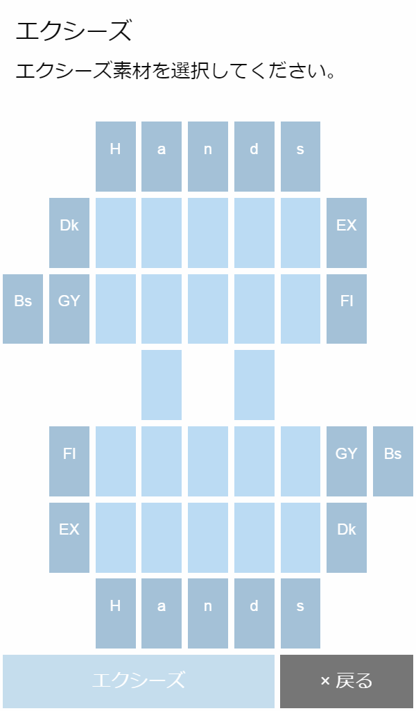

3. エクシーズ素材にするモンスターが存在するゾーンを指定してください。
4. 下部の「エクシーズ」ボタンを選択すると、エクシーズ素材に指定したゾーンから光が出現し、その光がエクシーズの渦に飲み込まれます。その後、再びフィールド選択画面が出現します。

	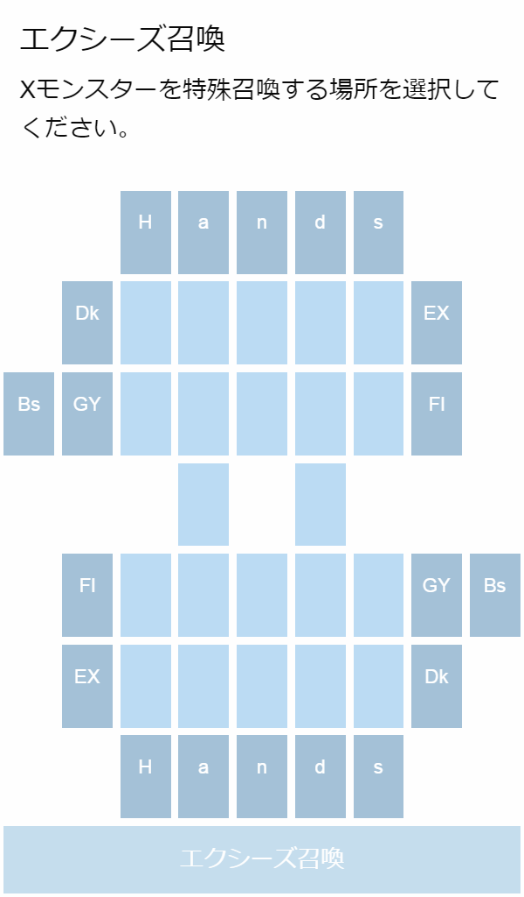

5. エクシーズモンスターの召喚場所を指定します。
6. 「エクシーズ召喚」ボタンを押すと、指定したゾーンにエクシーズ素材が出現し、EX召喚のエフェクトが適用されます。その後、ホーム画面に遷移します。
7. 一方、4において「エクシーズ」ボタンを押さずに「戻る」ボタンを押すと、エクシーズの渦が消え、ホーム画面に遷移します。

#### エクシーズ素材
エクシーズモンスターのエクシーズ素材の数を変更できます。エクシーズ素材を取り除く時、別のカードをエクシーズ素材にする際に使用してください。

1. ホーム画面の FieldFX タブに遷移します。

	

2. 「エクシーズ素材」ボタンを選択してください。
3. フィールド選択画面が出現するので、エクシーズ素材の数を変更したいゾーンを指定してください。

	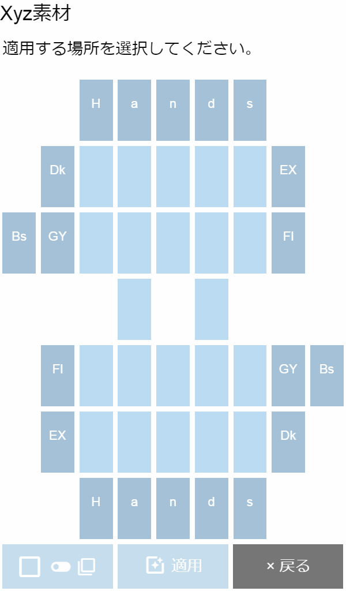

4. 素材数変更画面が現れるので、「+」もしくは「-」ボタンを押して素材の数を設定してください。

	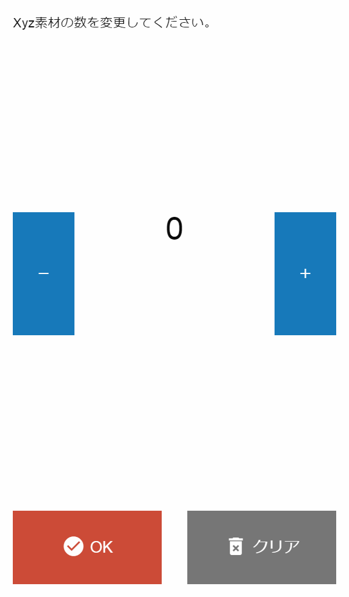

5. 下方左側の「OK」ボタンを押すと、3で指定したゾーンのエクシーズ素材の数が変化します。  
一方、下方右側の「クリア」ボタンを押すと、 __すべてのエクシーズ素材が消滅します。__
6. その後、自動的にホーム画面に遷移します。

### ペンデュラム
#### ペンデュラムスケール
自分のペンデュラムスケールを設定します。
1. ホーム画面の LP etc タブに遷移します。

	

2. 「左PS」もしくは「右PS」ボタンのどちらかを選択してください。
3. ペンデュラムスケール設定画面が出現します。

	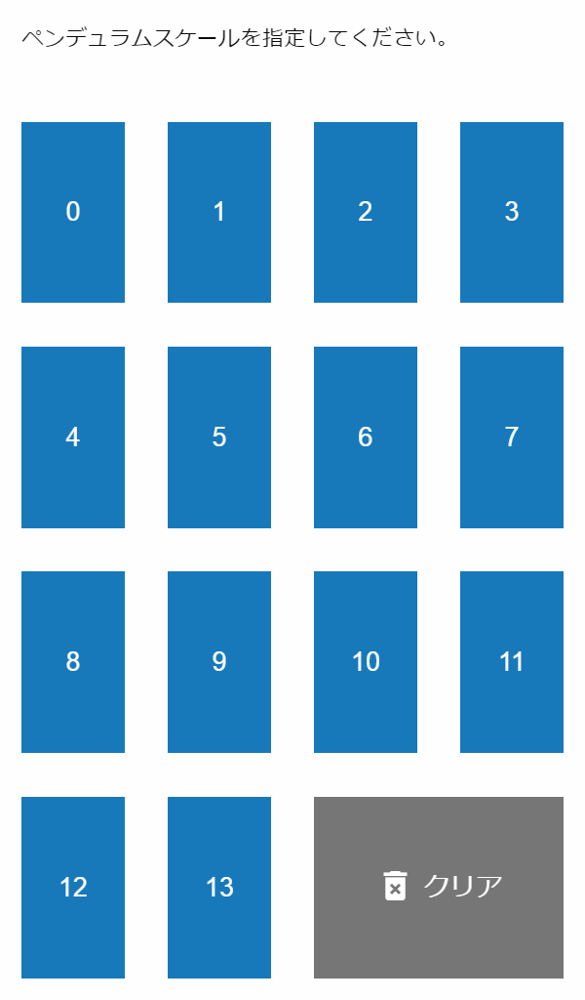

4. 数値が書かれたボタンを押すと、フィールド上に選択した側のペンデュラムスケールが出現します。  
一方、「クリア」ボタンを押すと、 __ペンデュラムスケールが消滅します。__

#### ペンデュラム召喚
ペンデュラム召喚を行う際に使用します。

1. 自分の左右のペンデュラムスケールがセットされているか確認してください。
2. ホーム画面の EX summon タブに遷移します。

	

3. 「ペンデュラム」ボタンを選択してください。すると、フィールドにはペンデュラムの軌跡が浮かび上がり、タブレット端末はEX召喚画面に遷移します。

	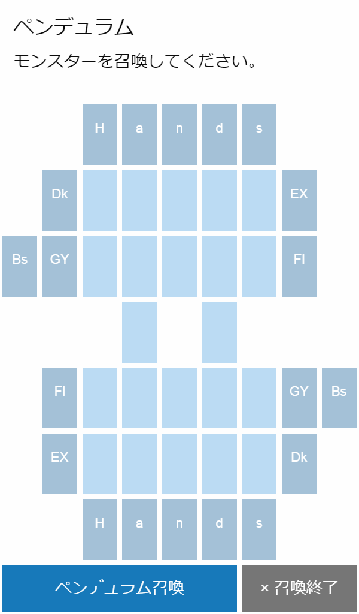

4. ペンデュラム召喚によって特殊召喚するモンスターの召喚場所を指定します。
5. 「ペンデュラム召喚」ボタンを押すと、指定したゾーンにエクシーズ素材が出現し、EX召喚のエフェクトが適用されます。この時、ホーム画面には自動で遷移しません。
6. 「召喚終了」ボタンを押すと、ペンデュラムの軌跡が消え、ホーム画面に遷移します。

### リンク
#### リンク召喚
リンク召喚を行う際に使用します。

1. ホーム画面の EX summon タブに遷移します。

	

2. 「リンク」ボタンを選択します。すると、フィールドにはサーキットが出現し、タブレット端末はEX召喚画面に遷移します。

	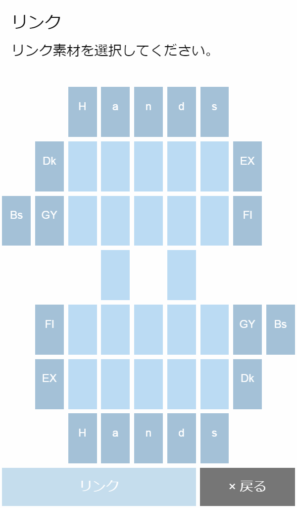

3. リンク素材にするモンスターが存在するゾーンを指定してください。
	1. ゾーンを指定すると、リンクマーカー設定画面が出現します。

		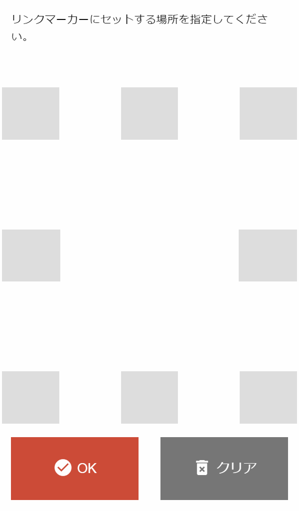

	2. リンク素材にするモンスターをサーキットにコンバインするマーカーの位置を設定します。既に他のゾーンでリンクマーカーが設定されている場合は、赤い灰色で示されます。

		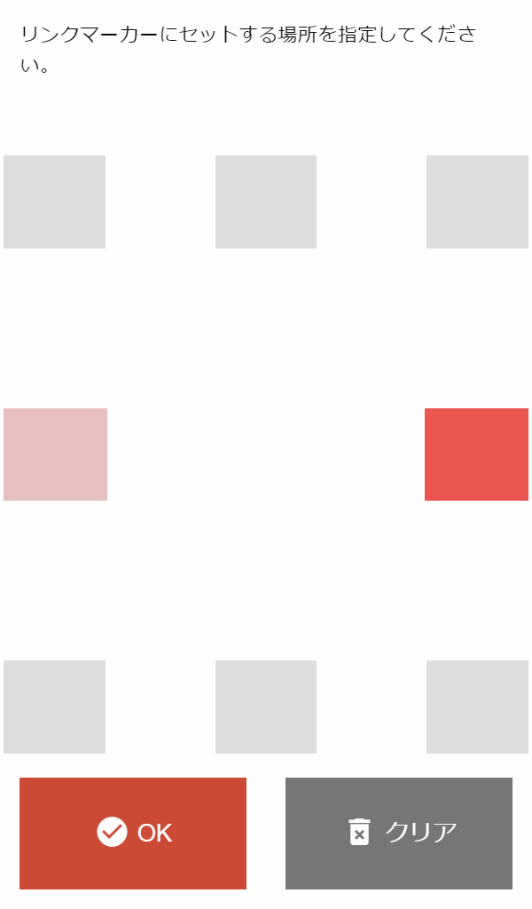

	3. 「OK」ボタンを押すと、指定したゾーンに、設定したマーカーの位置が表示され、EX召喚画面に遷移します。  
	一方、「OK」ボタンも押さずに「クリア」ボタンを押すと、 __設定したマーカーの位置がクリア__ され、EX召喚画面に遷移します。

		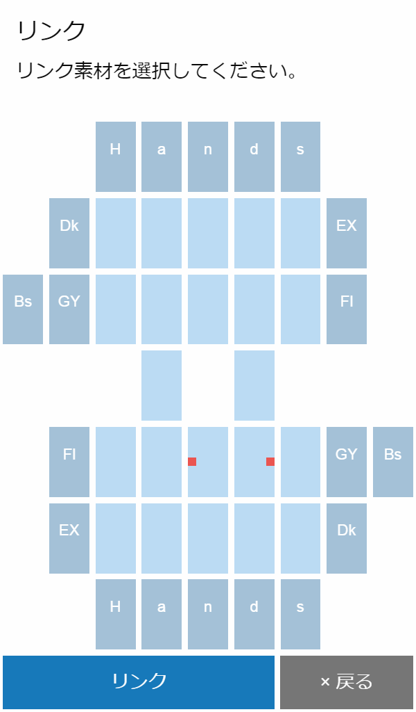

4. 下部の「リンク」ボタンを選択すると、リンク素材に指定したゾーンから、設定したマーカーに向かって竜巻が発生します。すべてのリンク素材がマーカーにコンバインされると、サーキットが強調され、サーキットが消失します。その後、再びフィールド選択画面が出現します。

	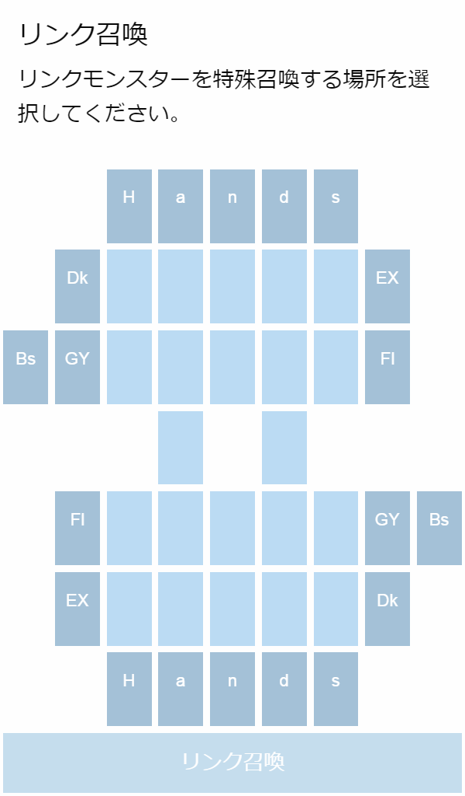

5. リンクモンスターの召喚場所を指定します。
6. 「リンク召喚」ボタンを押すと、指定したゾーンにEX召喚のエフェクトが適用されます。その後、ホーム画面に遷移します。
7. 一方、4において「リンク」ボタンを押さずに「戻る」ボタンを押すと、サーキットが消失し、自動的にホーム画面に遷移します。

#### リンクマーカー
リンクモンスターのリンクマーカーに関する操作を行う際に使用します。このエフェクトは、ホーム画面の FieldFX タブに存在します。
ここでは下記の2種類の操作を行えます。「リンクマーカー」ボタンを選択した時には、表示モードになっています。
* `表示モード` : リンクモンスターのマーカーを表示するリングを出現させます。
* `変更モード` : 指定されたゾーンに存在するカードのリンクマーカーを変更します。

ホーム画面の FieldFX タブに遷移し、「リンクマーカー」ボタンを選択すると、フィールド選択画面が出現します。他の FieldFX タブに存在するエフェクトとは異なり、下部のボタンが下記のように変わります。

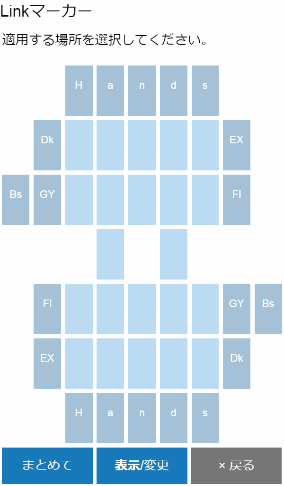

* `中央 - 「表示/変更」ボタン` : 表示モードおよび変更モードを切り替えます。
* `左側 - 「まとめて」ボタン` : 表示モードの場合、フィールドに存在するすべてのリンクモンスターにマーカーリングが出現します。変更モードの場合、このボタンは無効になっています。
* `右側 - 「戻る」ボタン` : 他の FieldFX タブに存在するエフェクトと同じく、ホーム画面に遷移します。

##### リンクマーカーの表示モード
このモードでは、フィールドの指定したゾーンに存在するカードが持つリンクマーカーと同じマーカーを持ったリングを表示します。

1. ホーム画面の FieldFX タブに遷移します。

	

2. 「リンクマーカー」ボタンを選択してください。
3. フィールド選択画面が出現するので、いずれかの方法でマーカーリングを表示したいカードが存在するゾーンを指定してください。

	

	* ゾーンを直接指定した場合、そのゾーンにリンクマーカーを持ったモンスターが存在すれば、そのマーカーリングを出現させます。その後、 __そのカードが持つリンクマーカー__ がすべて点滅します。再びそのゾーンを選択すると、マーカーリングが消滅します。
	* 「まとめて」ボタンを押した場合、
		* 既にマーカーリングが表示されていなければ、フィールド上のすべてのリンクマーカーを持ったカードが存在するゾーンにマーカーリングを出現させます。その後、 __リンクマーカーの指し示す方向にカードが存在するリンクマーカー__ がすべて点滅します。
		* 既にマーカーリングが表示されていれば、すべてのマーカーリングを消滅させます。
4. 「戻る」ボタンを押すと、すべてのマーカーリングが消滅します。その後、自動的にフィールド選択画面に遷移します。

##### リンクマーカーの変更モード
このモードでは、フィールドの指定したゾーンに存在するカードのリンクマーカーを変更します。この機能は、正規のリンク召喚以外の方法でリンクモンスターをフィールドに特殊召喚した場合に使用してください。

1. ホーム画面の FieldFX タブに遷移します。

	

2. 「リンクマーカー」ボタンを選択してください。
3. フィールド選択画面が出現するので、まずは「表示/変更」ボタンを選択してください。

	

4. 操作が変更モードになるので、リンクマーカーを変更したいカードが存在するゾーンを指定してください。

	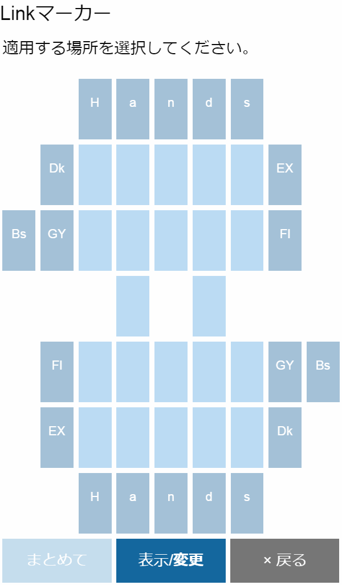

5. リンクマーカー設定画面が出現するので、そのゾーンに存在するカードと同じになるように、マーカーの位置を設定してください。

	

6. 「OK」ボタンを押すと、指定したゾーンに、設定したマーカーの位置が表示されます。表示モードにて既にマーカーリングを出現させていた場合は、 __そのマーカーリングも変更__ されます。  
一方、「OK」ボタンも押さずに「クリア」ボタンを押すと、 __設定したマーカーの位置がクリア__ されます。
7. その後、自動的にフィールド選択画面に遷移します。

## アイテムの使用
### コイン・ダイス
コイントスもしくはダイスロールを行う際に使用します。

1. ホーム画面の LP etc タブに遷移します。

	

2. 「コイン」または「ダイス」ボタンのいずれかを選択すると、フィールド上に記載された名前のアイテムが1つ出現します。
3. アイテム画面が出現するので、「+」もしくは「-」ボタンを押してアイテムの数を調整してください。最大6個まで出すことができます。

	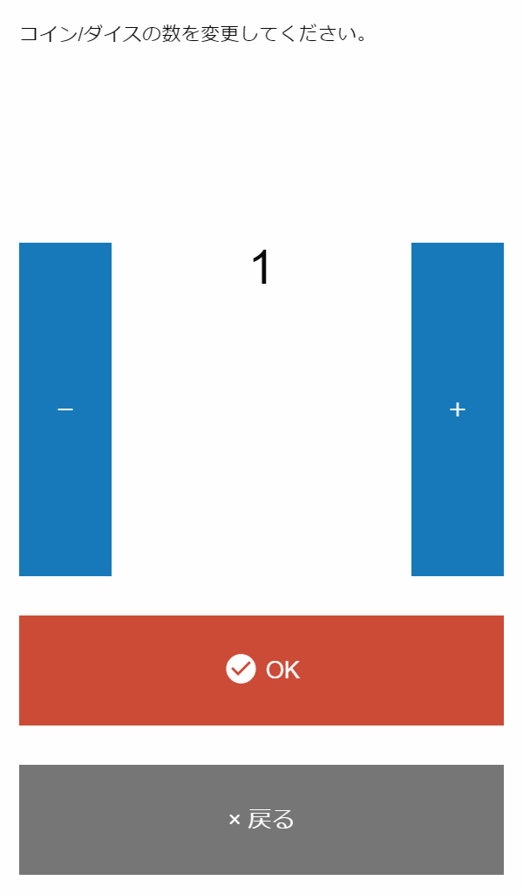

4. 「OK」ボタンを押すと、アイテムの結果が変わります。
5. 「戻る」ボタンを押すと、アイテムが消滅し、ホーム画面に遷移します。

### カウンター
カウンターの数を変更する際に使用します。フィールドのゾーン毎に最大3種類のカウンターを置くことができます。

1. ホーム画面の LP etc タブに遷移します。

	

2. 「カウンター」ボタンを選択します。
3. フィールド選択画面が出現するので、カウンターの数を変更したいゾーンを指定します。

	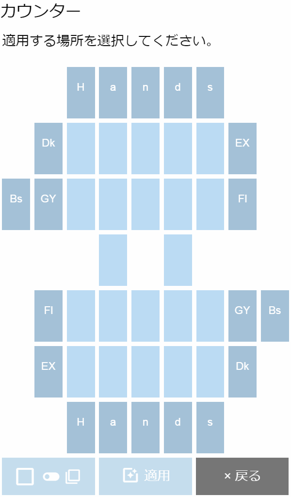

4. カウンター変更画面が出現するので、カウンターA/B/Cの数を「+」もしくは「-」ボタンを押してカウンターの数を調整してください。

	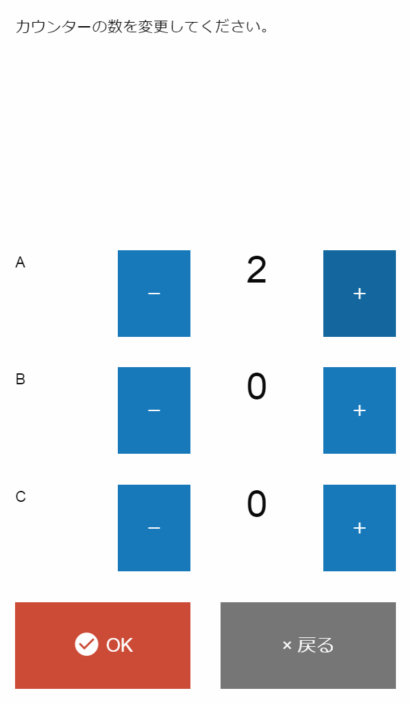

5. 「OK」ボタンを押すと、フィールド上に変更したカードの位置と各カウンターの数が表示され、フィールド選択画面に遷移します。  
一方、「OK」ボタンを押さずに「戻る」ボタンを押すと、カウンターの数は変更されないまま、ホーム画面に遷移します。

## 効果音
効果音を鳴らす際に使用します。

1. ホーム画面の Others タブに遷移します。

	

2. 鳴らしたい効果音のボタンを選択すると、その音が鳴ります。

## その他
上記以外の部分について説明します。

### フィールドリセット
フィールドのすべての情報を初期状態に戻す際に使用します。

1. ホーム画面の Others タブに遷移します。

	

2. 「設定」タブを選択します。
3. 設定画面が出現するので、「フィールドリセット」タブを選択します。

	

### フィールドログ
もし万が一バグが発生した時のために、フィールドの情報を確認します。現状は作者しか分からない情報を記載しています。

1. ホーム画面の Others タブに遷移します。

	

2. 「設定」タブを選択します。
3. 設定画面が出現するので、「フィールドログ」タブを選択します。

	

4. フィールドログ画面が出現するので、フィールドの情報を閲覧します。

	

5. 「戻る」ボタンを押すと、ホーム画面に遷移します。

### 詳細設定
下記の設定を変更します。 (実装予定)

* `Duel Mode` : マスターデュエルとスピードデュエルの設定を変更します。
* `Room Mode` : 明るい部屋か暗い部屋かどうかを設定します。
* `Chain Direction` : チェーンの数字の向きを、お互いのプレイヤーの向きにするかカメラ向きにするかを設定します。

# 最後に
Twitterに投稿したところ、沢山の方から反響をいただき、非常に嬉しく思っています。あくまで個人の開発したシステムではありますが、世界中の人がYARDSを使って遊べるようになることが最終的な目標です。

本システムで遊んでくださった方は、ぜひ「#DuelOnYARDS」のハッシュタグをつけてTwitterに投稿してください。皆さんから感想をいただけることが一番の励みになっています。この場を借りてお礼させてください、本当にありがとうございます！

YARDS作者 Reo